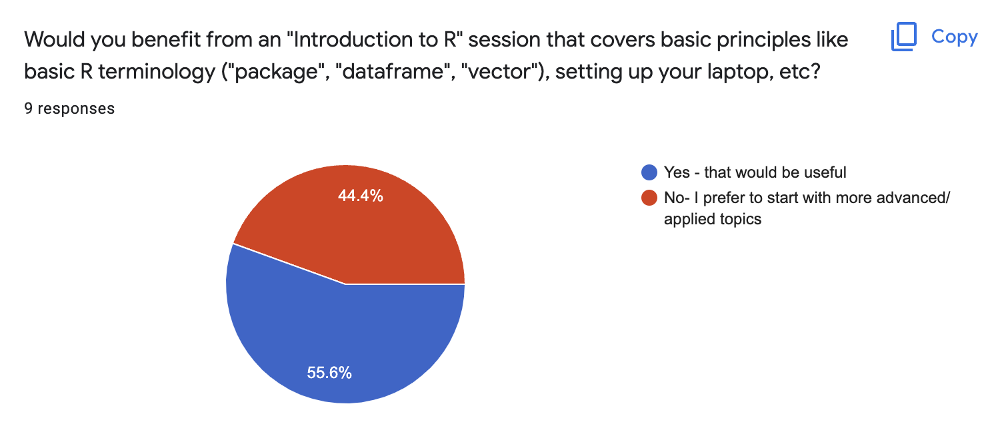
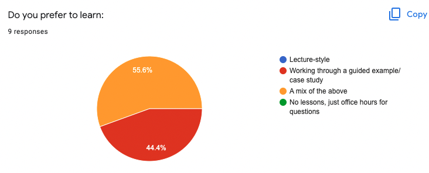
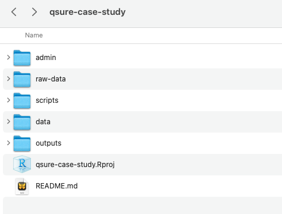

class: inverse, center, title-slide, middle
# `Lesson 1`
## June 7th, 2022

<p align="center"></p>

---
# Workshop Goal

.xxlarge[
Fill potential gaps in your R knowledge and help you get properly set up to conduct impactful and reproducible research during your time at MSK (and after!)
]


???

---
# Survey Results (> 75% Proficient in R! )

.pull-left[
<p align="center"></p>
<p align="center"></p>


]

.pull-right[

<p align="center"></p>


**Based on your feedback we will:**
- Short review on basic R vocab (today)
- Skip dplyr basics but include some advanced dplyr/data cleaning (today)
- Focus on project setup (today) 
- Focus on coding statistical analyses (next session)
- Optional 3rd session on R package making/Github
]


---


# Training Agenda

- **Lesson 1** – 6/7/2022
    - R Basics (Quick Review)
    - Project Setup & Reproducibility 
    - Guided Example 
        - Data Cleaning
        - Exploring your Data
- **Lesson 2** - 6/9/2022
    - Guided Example (Continuation) 
        - Analyzing/Modeling the Data
        - Reporting Your Results
- **Lesson 3** - TBD
    - Github 
    - Intro to Package Development

---
class: inverse, center, title-slide, middle

# R Basics

---
# R, Rstudio, Open source philosophy

- **R** is an object-oriented **open-source** programming language used mostly for statistical computing and graphics

- **Open source** means the original source code is freely available, and can be distributed and modified. Also, users can contribute to the usefulness by creating packages, which implement specialized functions for all kinds of uses (e.g. statistical methods, graphical capabilities, reporting tools). 
Added Bonus: vibrant R community!

- **RStudio** is an integrated development environment (IDE) for R. It includes a console, syntax-highlighting code editor that supports direct code execution, as well as tools for plotting, history, debugging and work space management.

---

<center>

</center>

---

# R Basics: General Things

- `<-` is the assignment operator (`=` also works)

```{r}
v1 <- c(1, 2, 3)
v1
```

- The `%>%` (pipe) from the magrittr package is a useful way to link functions together to make your code more succinct and easier to read

```{r, eval= FALSE}
library(dplyr)

mtcars %>% 
    select(mpg) %>% 
    filter(mpg == max(mpg))

```

- `?` is your friend if you want to look at documentation! (e.g. type `?mean()` in the console)

- R is case sensitive, bE cArEfUl!


---

# R Basics: Data Structures and Basic Syntax

R basic data types: 

* Logical (`TRUE`)
* integer (`1`)
* numeric (a.k.a. double) (`1.2`)
* character (`"Purple"`)
* factor ("a")
* complex (nobody ever uses these really)

---

# R Basics: Beware Data Type Coercion

- Since columns of a data.frame must be of the same type, some data may be coerced in unexpected ways when reading in a csv or excel file. 

- character is often the default for mixed data types

```{r, echo  = TRUE}

x <- c("apple", 3)
str(x)

```

```{r, echo  = TRUE}
y <- c(3, 2, "twenty") 
y
```

```{r, echo  = TRUE}
#sum(y)

```

---

# R Basics: Data Structures and Basic Syntax

R has 5 basic data structures: 

.pull-left[
1. vector
2. matrix
3. list
4. array
5. data.frame/tibble
]

---
# R Basics: Data Structures and Basic Syntax

.pull-left[
.bold[1. vector]
]

.pull-right[
- only 1 data type allowed

```{r}

# character
c("apple", "orange")

# numeric
c(1:15)
```
]

---
# R Basics: Data Structures and Basic Syntax

.pull-left[
1. vector
2. **matrix**
]

.pull-right[
2d, only 1 data type allowed

```{r}
letters <- c("a","b","c","d", "e", "f")
matrix(letters, nrow=2, ncol=3)
```
]


---
# R Basics: Data Structures and Basic Syntax

.pull-left[
1. vector
2. matrix
3. **list**
]

.pull-right[
- any data type allowed

```{r, eval = FALSE}
my_list <- list("a", 2, TRUE) 
str(my_list)
```
]


---
# R Basics: Data Structures and Basic Syntax
.pull-left[
1. vector
2. matrix
3. list
4. **array**
]


.pull-right[
- n-dimensions, of 1 data type

```{r}
# Create two vectors of different lengths.
vector1 <- c(5,9,3)
vector2 <- c(10,11,12,13,14,15)

array(c(vector1,vector2),dim = c(3,3,2))
```
]


---
# R Basics: Data Structures and Basic Syntax

.pull-left[
1. vector
2. matrix
3. list
4. array
5. **data.frame/tibble**
]

.pull-right[
    - any data type is allowed, but each column has to have the same type
    - the most important for data analysts. Most similar to an excel spreadsheet/statistical data file

```{r}
head(iris, 4)
```
]

---

# Exploring Your Data: Identify Data Types


- `colnames()` - will give you the column names
- `ncol()` and `nrow()` - will give you the total count of columns and rows respectively
- `class()`, `str()`, `attributes()` will give you meta-information on the object 
- `head()`, `tail()` show the top or bottom rows of your df
- `View()` will show the whole dataframe 
- `table()` will summarise variables

```{r}
str(iris)
nrow(iris)
```

---

# Exploring Your Data: Identify Data Types cont.

```{r}

colnames(iris)

class(iris)
head(iris[,1:3], 3)
table(iris$Species)

```

---

# Intro to tidyverse

The tidyverse package is a collection of R packages designed for data analysis, all of which share a similar design, grammar, and structure.

```{r}
# load it
library(tidyverse)

# check out the cute logo
tidyverse_logo()

```

---
# Intro to tidyverse

- readr: data import/export
- tibble: re-imagined data frames
- dplyr: data manipulation
- tidyr: data manipulation
- ggplot2: graphics and visualization
- purrr: functional programming toolkit, replaces the need for many loops
- stringr: string manipulation
- forcats: re-imagined factor data types

There are several additional packages which are installed as part of the tidyverse, but are not loaded by default.


---
# Intro to tidyverse

Overall tidyverse helps with code readability and has shortcuts for some common data manipulation tasks

tidyverse has been developed and significantly improved in the last few years, with a lot of ongoing work being done to further increase usability.

---


# tidyverse: data cleaning with dplyr 

The dplyr package is a data manipulation and cleaning package. A few of the key functions (verbs) in dplyr are:

- select()
- mutate()
- filter()
- arrange()
- group_by()
- summarize()

All take a data frame as input, and return a data frame as output.

**We will briefly review   during case study**

---
# The R Analysis Workflow

- Setup Your Project
- Clean and Explore Data
    - `tidyverse`
    - `lubridate` 
- Analyze it
    - `stats`
    - `survival`
    - `lme4`/ `nlme`
    - `ggplot2` 
- Report Your Findings
    - R Markdown / `knitr`
    - `gt` / `gtsummary`
    - `broom` 
- Iterate, Share, and Collaborate!
    - `git`/ `github`
    - `devtools` & `usethis`


---
class: inverse, center, title-slide, middle

# Project Setup
### How to organize your project to maximize reproducibility


---
# Reproducibility 

--
.xlarge[
*Why is a Reproducible R Workflow Important?*
]

--
- Allows you to show evidence of your results

- Encourages transparency about decisions made during analysis

- Enables others to check and use/extend your methods and results

- Enables FUTURE YOU to check and use/extend your methods and results


---
# Reproducibility 

.xlarge[
*Why is a Reproducible R Workflow Important?*
]

- Allows you to show evidence of your results

- Encourages transparency about decisions made during analysis

- Enables others to check and use/extend your methods and results

- Enables FUTURE YOU to check and use/extend your methods and results

.center[
.medium[
***"You mostly collaborate with yourself, and me-from-two-months-ago never responds to email"***
]
]
.pull-right[
.medium[
~ *Dr. Mark Holder, Computational Biologist*
]
]

---
# How do we ensure our R code is reproducible?

- Have a clear project structure and defined workflow

- **Comment and document your code**

- Use reproducible reporting practice (e.g. Rmd inline text)

- Avoid absolute file paths (e.g. `~/Users/Whiting/Projects...`)

- Version control (document changes you make, or use git!)

---
class: inverse, center, title-slide, middle

# Coding Exercise 
## Case Study: Diabetes Risk Factors

---
# Case Study - Modeling Diabetes Risk Factors

- Analyze risk factors for diabetes
- **Research Question:** Is waist to hip ratio a risk factor for diabetes?

- Outcome: glycosolated hemoglobin level (> 7 is considered diabetic)

- Available Variables of interest: 
    - cholesterol level 
    - stabilized glucose
    - location of individual
    - age
    - gender
    - height/weight
    - body frame
    - waist in inches
    - hip in inches
    
```{r}
library(faraway)
?diabetes
```


---
# Project Setup: Anatomy of a Project

.pull-left[

<p align="center"></p>

]
.pull-right[

- keep raw and processed data separate (`raw-data`, vs. `data`)

- folder for `scripts` ordered or labelled descriptively
- optionally can have `admin` for project notes, etc  and `outputs` for final reports and figures 

- **README** - text file that introduces and explains a project (`usethis::use_readme_md()`)
- **R Project (.Rproj file) ** - tells RStudio all your files belong to one project and sets working directory for entire project. 
]

---
# Project Setup


1. Create a new folder on your computer and name it "your-initials-case-study-2022"

2. Create subfolders within your project folder called: `admin`, `raw-data`, `scripts`, `data`, `outputs`

3. Create a new R Project in Rstudio from this folder (**File > New Project > Existing Directory**)

4. Go to https://github.com/karissawhiting/qsure-case-study-2022 and click **Code > Download ZIP**

5. Create a `README.md` using `usethis::use_readme_md()`

6. Drag contents of `raw-data` and `scripts` from  qsure-case-study-2022 to your new Project. 


---
class: inverse, center, title-slide, middle

# Thank You!


---
# Resources

- These materials will available on Github
- Data wrangling cheat sheet: https://www.rstudio.com/wp-content/uploads/2015/02/data-wrangling-cheatsheet.pdf
- Questions? Reach out to myself or Mike on teams or via email
- Create an R help channel on teams- help each other!
---


---
# Bonus Slides: Why Write a Function? 

- D.R.Y. - limit copy pasting and potential mistakes 

- Automate common tasks 

- You only need to update code in one place 


- If you are copy pasting code > 3 times, write a function

- Give your function a useful name 


---
# Bonus Slides: Function Example 

```{r}
add_one <- function(number) {
  result = number + 1 
  return(result)
}

add_one(7)
#add_one("hai")
```

---
# Bonus Slides: Function Practice

Write a function to calculate BMI given height (inchs) and weight (lbs) 

BMI = (weight * 703) / (height)^2 

```{r, eval = FALSE}
calc_bmi <- function() {
  ?????????????
}

```

---
class: inverse, center, title-slide, middle
# Case Study

https://github.com/karissawhiting/qsure-case-study-2022
---


